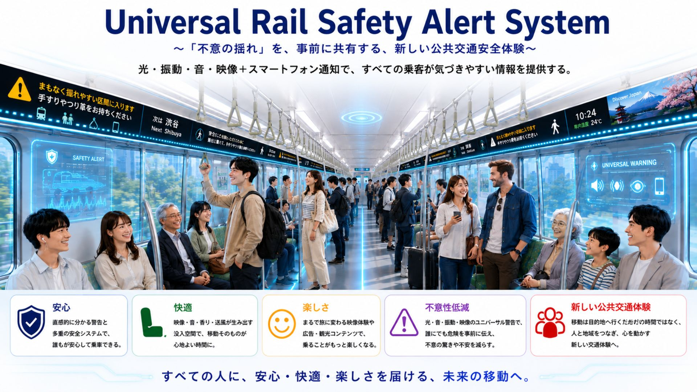
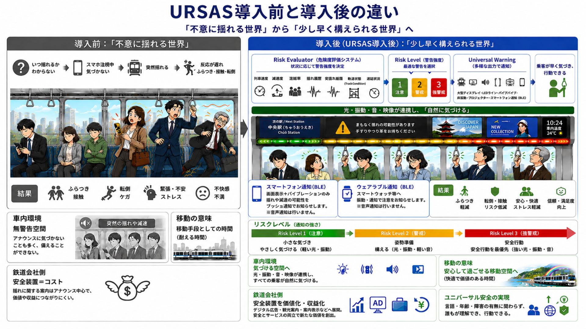
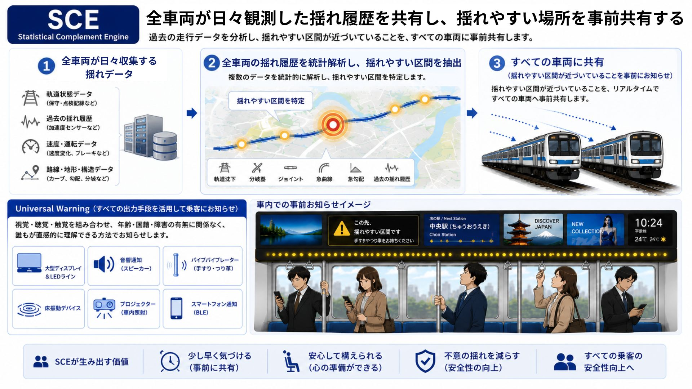
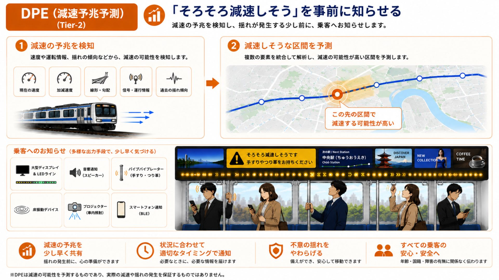
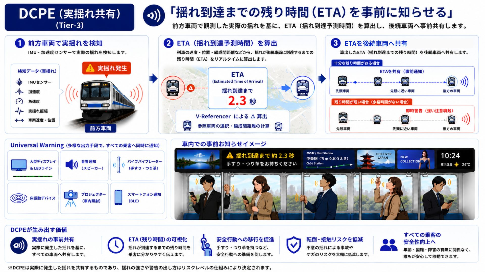
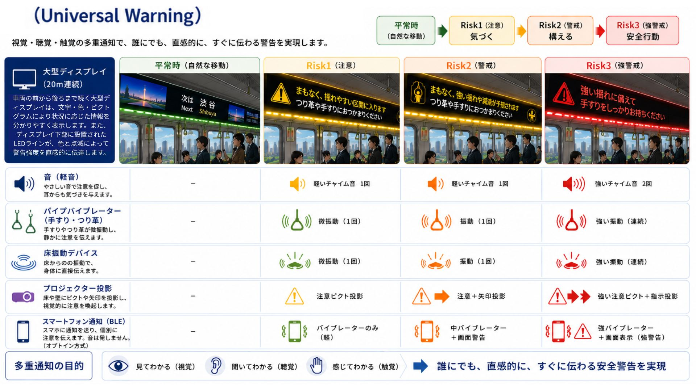
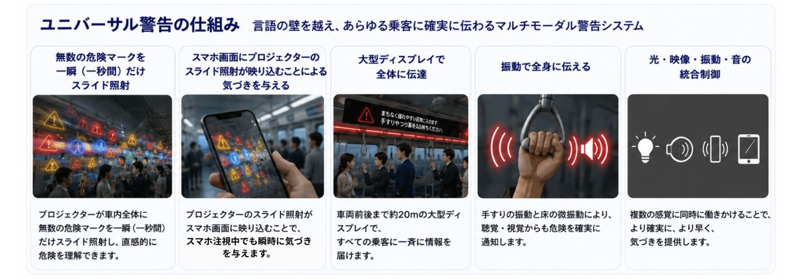
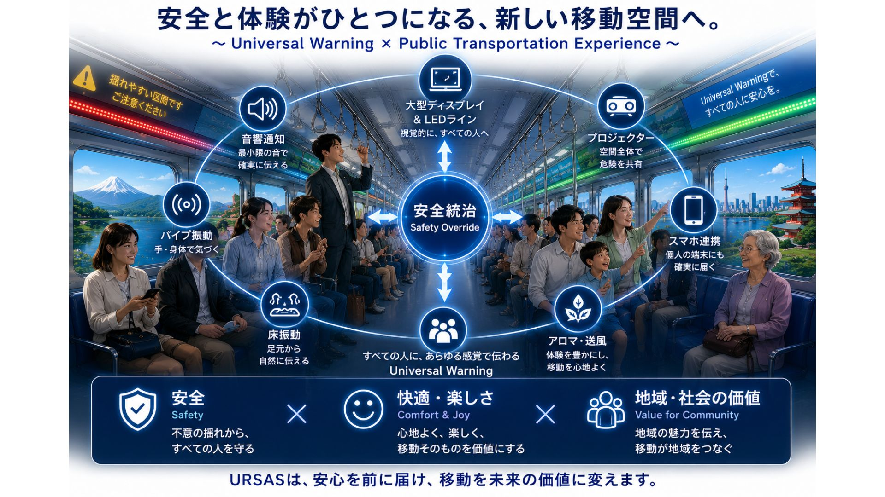

# URSAS

## Universal Rail Safety Alert System

### 列車の揺れを、起こる前に伝える。

---

🇯🇵 **日本語版**

🌍 **English Version (Coming Soon)**

---

> **Predicting railway motion before passengers experience it.**

---


## 📚 Contents

- URSASとは
- 3分でわかるURSAS
- White Paper
- Roadmap
---

## URSASとは
URSAS（Universal Rail Safety Alert System）は、列車の急減速や揺れを事前に予測し、乗客へ直感的に伝えることで、「Unexpectedness（不意性）」を低減する次世代鉄道安全支援システムです。
従来の鉄道安全システムは、地震や設備異常などの重大な危険への対応を中心に発展してきました。
一方で、日常的に発生する急減速や予期しない揺れは、転倒やふらつき、不安の原因となるにもかかわらず、乗客へ事前に知らせる仕組みはほとんど存在していません。
URSASは、この課題に対して「揺れが起こる前に伝える」という新しいアプローチを提案します。
過去の揺れ履歴、列車の走行状態、リアルタイムの車両情報を統合してリスクを予測し、光・映像・振動・音・スマートフォン通知など複数のデバイスを連携させることで、誰もが直感的に理解できる警告を提供します。 
その目的は、危険を知らせることだけではありません。
乗客一人ひとりが心と身体の準備を整え、安心・快適・安全に移動できる公共交通を実現すること。
それが、URSASの目指す新しい鉄道安全の姿です。 ```` --- ##


---

---

# 3分でわかるURSAS

URSASは、「揺れを予測し、乗客へ事前に伝える」ことで、乗客の **Unexpectedness（不意性）** を低減する鉄道安全支援システムです。

ここでは、その仕組みを7つのステップでご紹介します。

---

## STEP 1｜未来の公共交通

安全・快適・楽しさが融合した、URSASが目指す未来の公共交通です。



---

## STEP 2｜なぜURSASが必要なのか

現在の鉄道と、URSAS導入後の違いを比較します。



---

## STEP 3｜SCE（Route Risk Sharing）

過去の揺れ履歴を共有し、揺れやすい区間を事前に把握します。



---

## STEP 4｜DPE（Deceleration Prediction）

列車の減速を予測し、少し早く乗客へ知らせます。



---

## STEP 5｜DCPE（Real-time Car-to-Car Prediction）

前方車両の実際の揺れを共有し、ETA（到達予測時間）を算出します。



---

## STEP 6｜Universal Warning

予測したリスクを、すべての乗客へ分かりやすく伝えます。





---

## STEP 7｜Passenger Experience

安全・快適・楽しさを融合し、新しい公共交通体験を実現します。




---

# 📄 White Paper

URSASの設計思想・システム構成・各エンジンの詳細については、
ホワイトペーパーをご覧ください。

📥 [URSAS White Paper v5.4 (PDF)](docs/URSAS_WhitePaper_v5.4.pdf)

---

# 🚀 Roadmap

- ✅ Concept Design
- ✅ White Paper v5.4
- 🚧 GitHub Public Release
- 🚧 Prototype Development
- 🚧 Demonstration
- 🚧 Academic Publication
- 🚧 Railway Field Trial

---

URSASは継続的に進化していくプロジェクトです。
ご意見・ご提案を歓迎します。
